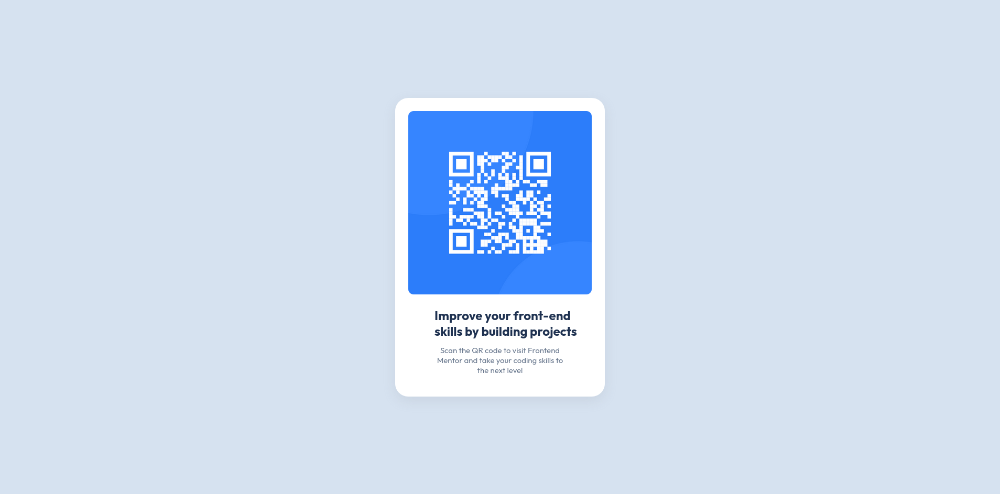

# Frontend Mentor - QR code component solution

This is a solution to the [QR code component challenge on Frontend Mentor](https://www.frontendmentor.io/challenges/qr-code-component-iux_sIO_H). Frontend Mentor challenges help you improve your coding skills by building realistic projects.

## Table of contents

- [Overview](#overview)
  - [Screenshot](#screenshot)
  - [Links](#links)
- [My process](#my-process)
  - [Built with](#built-with)
  - [What I learned](#what-i-learned)
  - [Continued development](#continued-development)
  - [Useful resources](#useful-resources)
  - [AI Collaboration](#ai-collaboration)
- [Author](#author)

## Overview

### Screenshot



### Links

- Solution URL: [Solution](https://willitbeadriel.github.io/QR-code-test/)

## My process

### Built with

- Semantic HTML5 markup
- CSS custom properties
- Flexbox
- [Shadow](https://getcssscan.com/css-box-shadow-examples) - Where I took the shadow

### What I learned

In this challenge, i managed to work out some of the basics of html, learn more about some css properties that i did't knew how to work with, like:
```css
*{
    overflow: hidden;
    max-width: 1440px;
    min-height: 0 auto;
}
```
And I managed to learn how to use google fonts and round items.

### Continued development

In the future, I will focus on learn exactly which css property I need to use in any circumstance and how to manage items sizes more efficientaly given any context.

### Useful resources

- [Shadow](https://getcssscan.com/css-box-shadow-examples) - This site has some pretty cool looking shadows.

### AI Collaboration

I used Claude chat to figure out some things, like why my live server was displaying some weird message or how to round the items. It worked pretty well, I didn't asked for major help.

## Author

- Frontend Mentor - [@willitbeadriel](https://www.frontendmentor.io/profile/willitbeadriel)
- Twitter - [@willitbeadriel](https://x.com/willitbeadriel)